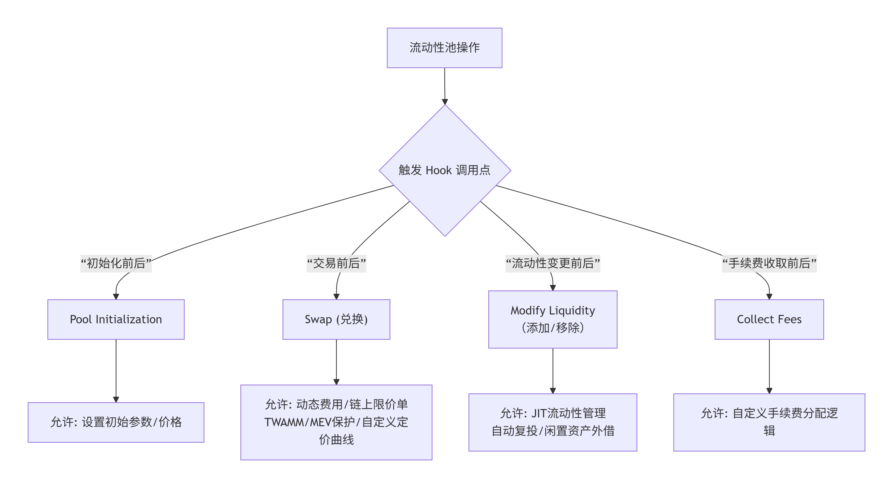

# Uniswap V4 学习笔记

Uniswap V4 不仅仅是一次版本迭代，更是对去中心化交易所 (DEX) 和自动化做市商 (AMM) 根本范式的重新构想。它从“一个为所有人服务的协议”转向“一个供所有人构建协议的框架”。

与之前版本专注于优化资本效率（V3的集中流动性）不同，V4的核心是**开放性与可组合性**，旨在通过模块化设计，将Uniswap从一个固定的交易协议转变为一个可编程的流动性基础设施平台。

### **一、 核心理念：**

你可以将 V3 及之前的版本理解为官方出品、功能固定的“乐高套装”。用户只能在预设的规则下（如固定的费用等级、固定的价格曲线）进行组合。

而 **V4 则提供了一套“乐高基础板”和标准接口（Hooks）**，允许任何开发者创建全新的、自定义的积木，并将其无缝接入整个系统。这开启了“万钩演义”时代，协议的功能边界被无限拓展。

| **维度** | **Uniswap V3** | **Uniswap V4** | **V4 带来的变革** |
| --- | --- | --- | --- |
| **设计哲学** | **高效但封闭**：在预设模型内极致优化。 | **开放且可编程**：提供基础层，允许无限自定义。 | 从“成品”到“基础设施”。 |
| **核心创新** | 集中流动性，主动管理。 | **Hooks（钩子）**，可定制逻辑。 | 功能从协议层下放到应用层。 |
| **架构模式** | 工厂-配对合约模式：每个流动性池一个独立合约。 | **单例（Singleton）模式**：所有池存在于一个合约中。 | 大幅降低 Gas 成本，提升跨池操作效率。 |
| **费用结构** | 固定的几个费率等级（如0.05%， 0.30%， 1%）。 | **无限制费用**，支持动态、自定义费用。 | 适应更广泛的资产和策略需求。 |
| **流动性凭证** | 非同质化代币（ERC-721），代表独特头寸。 | **非代币化地址管理**（主流方式），简化管理并集成 **ERC-6909** 等高效标准。 | 降低 Gas 消耗，提升复杂策略的可行性。 |
| **ETH 交易** | 需使用包装版 ETH（WETH）。 | **原生 ETH 支持**，可直接交易。 | 改善用户体验，降低交易成本和步骤。 |

### **二、 核心创新机制深度解析**

### **1. Hooks：可编程流动性的灵魂**

**Hooks 是 V4 的决定性特征**。它们是部署在 Uniswap V4 核心合约（PoolManager）之外的外部智能合约，可以在流动性池生命周期中的**特定关键时刻被调用并执行自定义逻辑**。

你可以将 Hook 想象成泳池的智能管理系统。它可以在有人跳入前（交易前）检查水质，在有人离开后（流动性移除后）自动补充化学药剂，甚至可以根据一天中的时间（区块状态）动态调整水温（费用）。

**工作机制与调用点：**

一个流动性池在创建时可以选择绑定一个 Hook 合约。此后，池的关键操作将触发对 Hook 合约中特定函数的调用。下图梳理了主要的 Hook 调用时机及其允许的自定义操作：

**主流应用场景示例：**

- **链上限价订单**：在 `beforeSwap` 中检查当前价格，仅在达到目标价时执行交易。
- **动态费用**：在 `beforeSwap` 中根据波动性、交易量或时间动态计算并设置本次交易的手续费。
- **时间加权平均做市商（TWAMM）**：将大额订单拆分成无数小订单，在长时间内平滑执行，以降低滑点和市场影响。
- **跨协议组合**：在 `afterAddLiquidity` 后，将超出指定价格范围的闲置资产自动存入借贷协议（如 Aave）赚取额外收益；或在 `afterModifyLiquidity` 后将赚取的手续费自动复投。
- **MEV 保护与收益共享**：通过异步交易等方式防止三明治攻击，并将套利产生的部分 MEV 利润捕获并分配给该池的流动性提供者。

### **2. Singleton架构：**

为了支撑 Hooks 生态带来的海量、复杂的池间交互，V4 废弃了传统的工厂-配对合约模式，采用了 Singleton（单例）架构。

- **V3 模式**：每个交易对（如 ETH/USDC）都是一个独立的智能合约。跨多个池的交易需要在合约间转移代币，产生高昂的 Gas 费。
- **V4 模式**：所有流动性池都作为**内部数据结构**存在于一个统一的 `PoolManager` 核心合约中。

**优势：**

1. **Gas 费用大幅降低**：创建新池的成本估计可比 V3 降低 **99%**。多跳交易（如 ETH -> USDC -> DAI）也因免去中间代币的跨合约转账而变得极其廉价。
2. **支持闪电记账**：这是单例架构的自然延伸。系统在整个交易生命周期内只追踪代币的**净余额变化（delta）**，在所有操作结束时一次性结算净额。这类似于“闪电贷”的原子性，确保了安全，同时将计算和状态更新成本降至最低。
3. **简化复杂性**：流动性仓位管理不再强制依赖 NFT，可以通过地址直接管理，为开发更复杂的策略提供了便利。

### **3. Flash Accounting**

这是实现 Gas 效率奇迹的关键技术之一。它利用以太坊“坎昆升级”引入的 **EIP-1153 瞬态存储**特性。

- **原理**：在交易执行过程中，所有的代币余额变动、费用计算等中间状态都记录在瞬态存储（便宜且交易后自动清除）中，而非永久存储（昂贵）。
- **过程**：仅在交易序列的最后，核对所有操作的输入输出净差额，并进行一次性的代币划转。如果净差额不平衡（例如，用户未支付足够的输入代币），则整个交易回滚，确保资金安全。

### **4. 其他重要特性**

- **原生 ETH**：用户可以直接使用 ETH（而非 WETH）进行交易，简化了操作流程并节省了包装/解包的费用。
- **无限制费用层级**：池的创建者可以设置任意数值的手续费，甚至可以与 Hook 结合实现动态费用，突破了 V3 的固定费率限制。

### **三、 技术架构与合约交互简析**

1. **核心合约 `PoolManager`**：
    - 这是单例架构的核心，管理所有池的状态。
    - 它不持有实现 AMM 逻辑的代码，而是通过 `delegatecall` 调用外部的 `Pool` 库。
    - 关键结构体 `PoolKey` 用于唯一标识一个池，包含代币对、费率、Tick间距和绑定的 Hook 地址。
2. **流动性生命周期**：
    - 用户或前端通常通过与 `NonfungiblePositionManager`（管理仓位）或自定义的路由器合约交互。
    - 路由器调用 `PoolManager`，`PoolManager` 在执行关键动作（`initialize`, `swap`, `modifyLiquidity`）前后，会检查池是否绑定了 Hook，并调用 Hook 合约的相应函数。
    - Hook 合约可以决定是否允许操作继续、修改参数，甚至完全接管执行逻辑（如实现一条全新的定价曲线）。

### **总结**

Uniswap V4 通过 **Hooks（可编程性）** 与 **Singleton + Flash Accounting（极致效率）** 的组合，完成了一次从“协议”到“平台”的升维。它不再仅仅定义“如何交易”，而是定义了“如何构建交易场所”。这标志着 DeFi 乐高进入了一个全新的、更具创造力但也更复杂的阶段。